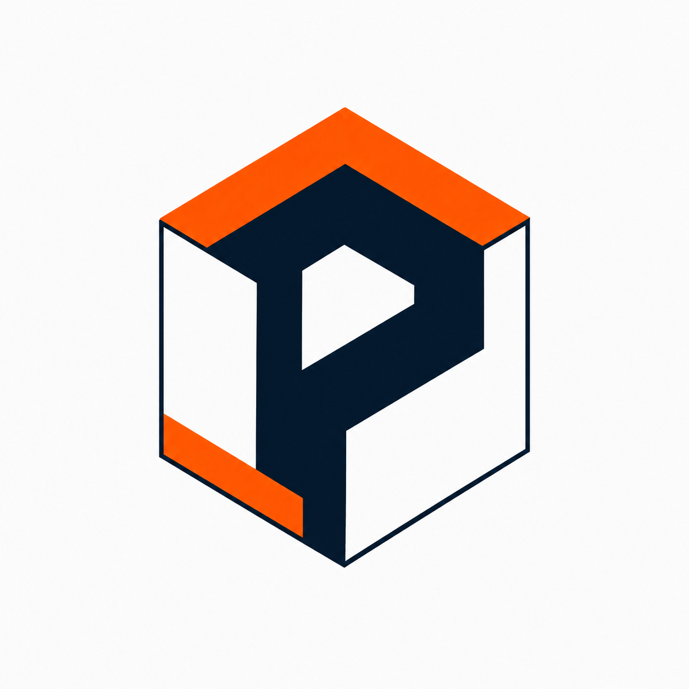

<p align="center">
  
</p>

<h1 align="center">Plugger — Plugin Framework for Illumio PCE</h1>

<p align="center">

[](https://alexgoller.github.io/illumio-plugger/)
[](docs/plugin-development.md)
[](LICENSE)
[](https://alexgoller.github.io/illumio-plugger/)

</p>

Plugger is a Go CLI that manages Illumio PCE extensions as Docker containers — install, schedule, health-check, auto-restart, and expose them through a unified web dashboard. Includes a Python SDK for rapid plugin development and a shared reporting bus (Slack/Teams/email/webhook). No patch cycles. No custom integrations hardwired into your environment. Just `plugger install <name> && plugger run`.

> Community project by [Alex Goller](https://github.com/alexgoller), Illumio Solutions Architect. Not an official Illumio product.

---

## Quick Start

```bash
# 1. Build
git clone https://github.com/alexgoller/illumio-plugger
cd illumio-plugger && make build

# 2. Initialize — writes ~/.plugger/config.yaml with PCE connection details
plugger init

# 3. Install a plugin and start everything
plugger install ai-security-report
plugger run
```

Dashboard opens at `http://localhost:8800`. Registry browser at `http://localhost:8800/registry`.

---

## Plugin Highlights

### AI Security Report
Connects to your PCE, analyzes workload posture across 10 security dimensions, maps findings to NIST CSF and PCI-DSS controls, and produces a scored HTML report with a remediation roadmap. No manual data gathering — point it at your PCE and read the output.

```bash
plugger install ai-security-report && plugger run
# Report appears at http://localhost:8800/ai-security-report
```

### Workload Isolator
Exposes a webhook endpoint. When CrowdStrike, Splunk SOAR, or any EDR signals a compromise, it flips the workload into selective enforcement, cutting lateral movement in seconds. Optional TTL auto-releases after investigation.

```bash
plugger install workload-isolator
# POST /isolate {"hostname": "web-prod-07"} → quarantined
```

### Policy Resolver
Translates Illumio's label-based policy into concrete IP-level firewall rules your network team can read. Useful for audits, firewall migration projects, and proving to a skeptical network engineer that your segmentation policy actually does what you think it does.

### App Dependency Intelligence
Analyzes PCE traffic flows to build an application dependency graph. Surfaces blast radius (what breaks if this service goes down), single points of failure, compliance boundary crossings, and resiliency scores. Built on D3.js — the visualization is interactive.

---

## All 24 Plugins

### Monitoring & Visibility

| Plugin | Description | Mode |
|--------|-------------|------|
| [pce-health-monitor](pce-health-monitor/) | Real-time PCE health dashboard — endpoint checks, CPU/memory/disk | Daemon + UI |
| [traffic-reporter](traffic-reporter/) | Interactive traffic flow analysis — top talkers, blocked flows, Sankey diagram | Daemon + UI |
| [policy-diff](policy-diff/) | Git-like policy change tracker — field-level diffs, user attribution, audit trail | Daemon + UI |
| [pce-events](pce-events/) | Real-time PCE event fan-out — Slack, Teams, PagerDuty, Email, 15+ outputs | Daemon + UI |
| [ven-fleet-manager](ven-fleet-manager/) | VEN fleet visibility — enforcement progress, compatibility, version distribution, upgrade readiness | Daemon + UI |
| [stale-workloads](stale-workloads/) | Find offline, unresponsive, and traffic-silent workloads — with optional cleanup | Daemon + UI |
| [network-discovery](network-discovery/) | Scan traffic for bare IPs, reverse-DNS, create unmanaged workloads | Daemon + UI |

### AI & Security Analysis

| Plugin | Description | Mode |
|--------|-------------|------|
| [ai-security-report](ai-security-report/) | AI-powered security posture scoring across 10 categories — NIST/PCI mapping, heatmap, roadmap | Daemon + UI |
| [ai-assisted-rules](ai-assisted-rules/) | Policy advisor — blocked traffic analysis, tiered rule generation, label gap detection, LLM recommendations | Daemon + UI |
| [pce-posture-report](pce-posture-report/) | Enforcement coverage, label coverage, policy rules scoring — HTML+JSON output | Cron |
| [app-dependency-intel](app-dependency-intel/) | Application dependency graph — blast radius, SPOF detection, resiliency scoring, D3.js visualization | Daemon + UI |
| [vmaps-handler](vmaps-handler/) | Import vulnerability scans into PCE vmaps — Nessus, Qualys, Tenable | Daemon + UI |

### Policy Management

| Plugin | Description | Mode |
|--------|-------------|------|
| [policy-resolver](policy-resolver/) | Resolve label-based policy to IP-level firewall rules — JSON export, searchable dashboard | Daemon + UI |
| [rule-scheduler](rule-scheduler/) | Time-based rule scheduling — business hours, maintenance windows, weekend lockdowns | Daemon + UI |
| [workload-isolator](workload-isolator/) | Webhook-triggered workload quarantine — EDR/SOAR integration, TTL auto-release, audit trail | Daemon + UI |
| [policy-gitops](policy-gitops/) | Policy-as-code — sync rulesets/IP lists/services as YAML to Git with drift detection ([standalone repo](https://github.com/alexgoller/illumio-policy-gitops)) | Daemon + UI |
| [policy-workflow](policy-workflow/) | Approval workflow engine — multi-stage pipelines, Slack/ServiceNow integration, audit log | Daemon + UI |

### Integrations

| Plugin | Description | Mode |
|--------|-------------|------|
| [palo-alto-dag-sync](palo-alto-dag-sync/) | Sync Illumio labels to Palo Alto Dynamic Address Groups via PAN-OS XML API | Daemon + UI |
| [ztna-sync](ztna-sync/) | Sync workloads to ZTNA apps — Zscaler ZPA, Netskope NPA, Cloudflare Access, Cisco Secure Access | Daemon + UI |
| [infoblox-ipam-sync](infoblox-ipam-sync/) | Bi-directional sync between Illumio labels and Infoblox extensible attributes | Daemon + UI |
| [remedy-cmdb-sync](remedy-cmdb-sync/) | Sync BMC Helix/Remedy CMDB CIs to Illumio labels — analytics mode for feasibility testing | Daemon + UI |
| [ad-label-sync](ad-label-sync/) | Discover AD computers via LDAP, map OU/group/location attributes to Illumio labels | Daemon + UI |
| [fortigate-sync](fortigate-sync/) | Sync to FortiGate via RSSO + REST API | Daemon + UI |
| [vcenter-sync](vcenter-sync/) | Bi-directional VMware vCenter sync | Daemon + UI |

---

## Plugin Registry

```bash
plugger search                          # List all available plugins
plugger search monitoring               # Filter by keyword
plugger install pce-health-monitor      # Install from registry
plugger outdated                        # Check for updates
plugger upgrade traffic-reporter        # Pull latest, restart
plugger repo add myco https://internal.example.com/registry.json  # Custom registry
```

The web dashboard at `http://localhost:8800/registry` lets you browse, filter, and install with one click.

Custom registries: host a `registry.json` at any URL using the same format as the [official registry](https://alexgoller.github.io/illumio-plugger/registry.json).

---

## Building Plugins

Scaffold a new plugin in any supported language:

```bash
plugger create -t python my-plugin     # Python (most existing plugins)
plugger create -t go my-plugin         # Go with Illumio SDK
plugger create -t shell my-plugin      # Shell script
```

Each template includes a `plugin.yaml` manifest, health endpoint, Illumio credential injection, and a working Dockerfile. See [Plugin Development](docs/plugin-development.md).

---

## Python SDK

Plugins written in Python can use `plugger_sdk.py` to eliminate boilerplate:

```python
from plugger_sdk import Plugin

app = Plugin("my-plugin")

@app.poll(interval_env="POLL_INTERVAL", default=3600)
def work(pce):
    app.state["data"] = pce.get("/workloads").json()

@app.api("GET", "/api/data")
def get_data(request):
    return app.state

@app.dashboard
def render():
    return "<html>...</html>"

app.run()
```

The SDK handles PCE connection, health endpoints, state management, scheduled polling, API routing, and report publishing via the shared output bus.

---

## Reporting & Outputs

Plugins publish reports to a shared bus. Plugger routes to Slack, Teams, email, or webhooks.

```bash
plugger output add my-slack --type slack --webhook https://hooks.slack.com/...
plugger output add my-teams --type teams --webhook https://outlook.office.com/...
plugger output list
plugger output test my-slack
```

---

## How It Works

Plugger runs each plugin as a Docker container with a declarative manifest:

```yaml
# plugin.yaml
apiVersion: plugger/v1
name: my-plugin
schedule:
  mode: daemon          # daemon | cron | event
env:
  - name: POLL_INTERVAL
    default: "3600"
health:
  endpoint: /healthz
  port: 8080
```

`plugger run` reads all installed manifests, starts containers, injects PCE credentials, proxies plugin UIs under a single port, streams logs, and restarts failed containers with exponential backoff.

**Three scheduling modes:**
- `daemon` — runs continuously, auto-restart on crash
- `cron` — runs on a schedule (e.g., nightly reports)
- `event` — ephemeral container triggered by webhook (incident response, PCE events)

---

## Documentation

| Guide | Description |
|-------|-------------|
| [Getting Started](docs/getting-started.md) | First-time setup walkthrough |
| [Installation & Configuration](docs/installation.md) | Prerequisites, config options, Docker socket, networking |
| [CLI Reference](docs/cli-reference.md) | All commands and flags |
| [Plugin Development](docs/plugin-development.md) | Manifests, templates, health checks, publishing |
| [Operations Guide](docs/operations.md) | Production deployment, monitoring, troubleshooting |
| [Event-Driven Architecture](docs/events.md) | Webhook triggers, pce-events integration, auth |

**Plugin Portal:** [alexgoller.github.io/illumio-plugger](https://alexgoller.github.io/illumio-plugger/)

**Policy-as-Code (standalone):** [illumio-policy-gitops](https://github.com/alexgoller/illumio-policy-gitops)

---

## License

Apache 2.0
